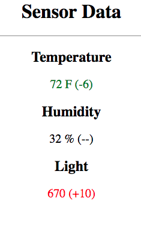

# Assignment 5
**Due Nov 6th before class**

## Task 
Starting with
implement a client side (only) that shows you the changes in
temperature, humidity and light. 

## References
Assignment 4 and code handout

## Grading
Evaluated with demo in class.
